# Лабораторная работа 1

Управление многоконтейнерными системами

**Автор:** Атаев Перман. **Группа:** 13. **Учебный год:** 2026–2027.


## Цель работы и используемое окружение

Цель работы — изучить технологии контейнеризации, управление образами и контейнерами Docker, создание Dockerfile и организацию многоконтейнерного приложения с помощью Docker Compose.

В соответствии с критериями методических указаний для группы 13 я выполнил задания 1–4. В работе я последовательно запустил Nginx, создал и опубликовал собственный образ, разработал приложение с PostgreSQL, сравнил варианты сборки и описал инфраструктуру из трёх сервисов в compose.yaml. Варианты предметных областей задания 5 к моему объёму работы не относятся.

| Компонент | Использованное окружение |
| --- | --- |
| Операционная система | Windows, сборка 26200.9457; PowerShell |
| Контейнеризация | Docker Desktop с Linux-контейнерами и WSL2 |
| Docker / Compose | 29.8.1 / v5.5.1 |
| WSL / Python | 3.0.1 / Python 3.14.7 локально |
| Веб-приложение | FastAPI 0.142.2; Uvicorn 0.53.0 |
| Драйвер PostgreSQL | psycopg2-binary 2.9.13 локально; psycopg2 2.9.13 в образе |
| База данных | postgres:16.2-alpine |

Я использовал Python 3.14 вместо Python 3.12 из примера методички и подобрал совместимые версии зависимостей. В Dockerfile применены теги python:3.14, python:3.14-slim и python:3.14-alpine. Их содержимое может изменяться; приведённые размеры относятся к сборкам, зафиксированным на моих скриншотах.

Порядок отчёта: задание 1 — управление контейнерами; задание 2 — публикация образа; задание 3 — приложение и оптимизация; задание 4 — Compose; затем исходные конфигурации, контрольные вопросы и выводы.


## Задание 1 Подготовка Docker и первый запуск

Сначала я установил WSL и компонент виртуализации Windows, перезагрузил компьютер и установил Docker Desktop. После запуска движка проверил клиентские утилиты и доступность сервера Docker.

```powershell
wsl --status
wsl --version
docker --version
docker compose version
docker info
```

Первоначальная ошибка подключения к dockerDesktopLinuxEngine исчезла после запуска Docker Desktop. Наличие раздела Server в docker info подтвердило доступность движка.

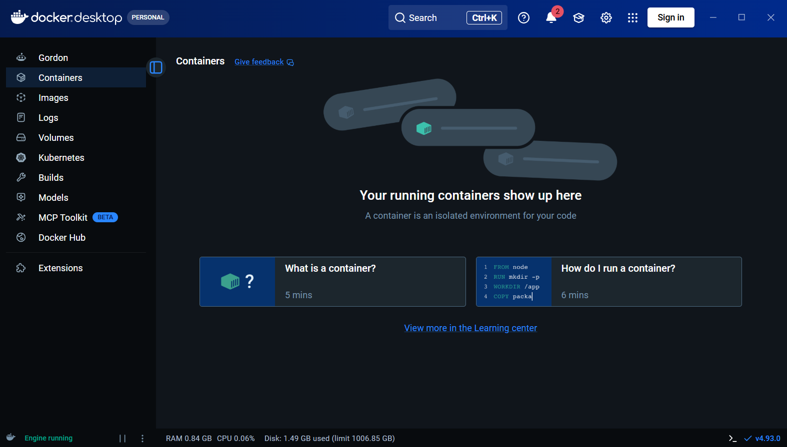

Затем я запустил контейнер mynginxlast из nginx:latest. Параметр -d задаёт фоновый режим, а -p 8081:80 связывает порт компьютера с портом веб-сервера в контейнере.

```powershell
docker run -d --name mynginxlast -p 8081:80 nginx:latest
docker ps
curl.exe -I http://localhost:8081
```

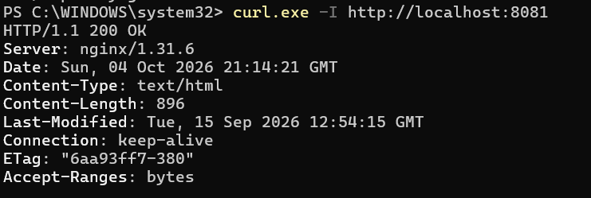


## Задание 1 Три образа Nginx и списки контейнеров

После первого запуска я добавил контейнеры на основе Alpine и Nginx 1.28. Для одновременной работы использовал разные порты хоста.

| Образ | Контейнер | Порт хоста |
| --- | --- | --- |
| nginx:latest | mynginxlast | 8081 |
| nginx:alpine | mynginxalpine | 8082 |
| nginx:1.28 | mynginx1-28 | 8083 |

```powershell
docker run -d --name mynginxalpine -p 8082:80 nginx:alpine
docker run -d --name mynginx1-28 -p 8083:80 nginx:1.28
docker ps
docker ps -a
docker image ls
```

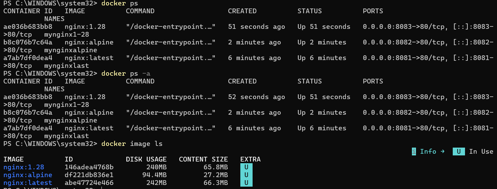

Команда docker ps показала работающие контейнеры, docker ps -a — все контейнеры, docker image ls — образы. Я проверил каждый веб-сервер через curl.exe и браузер. Для портов 8082 и 8083 получены ответы HTTP 200 OK.

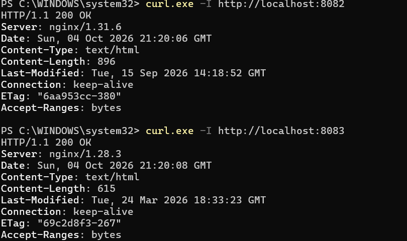


## Задание 1 Остановка запуск и удаление

Я остановил mynginx1-28 и сравнил списки контейнеров. Остановленный контейнер исчез из docker ps, но остался в docker ps -a со статусом Exited. Затем я запустил его снова и проверил ответ веб-сервера.

```powershell
docker stop mynginx1-28
docker ps
docker ps -a
docker start mynginx1-28
curl.exe -I http://localhost:8083
```

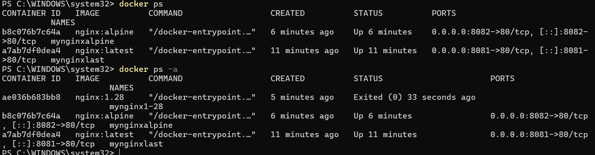

Далее я остановил и удалил контейнер. Повторный просмотр образов показал, что nginx:1.28 сохранился: удаление контейнера и удаление образа — разные операции. После проверки я создал контейнер заново.

```powershell
docker stop mynginx1-28
docker rm mynginx1-28
docker image ls
docker run -d --name mynginx1-28 -p 8083:80 nginx:1.28
```

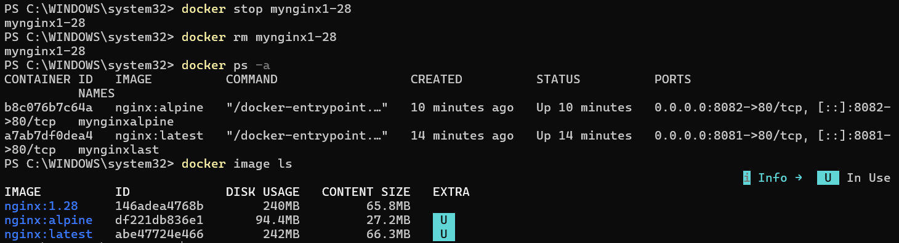


## Задание 1 Интерактивная работа

Для входа в уже работающий контейнер я использовал docker exec -it. В оболочке выполнил hostname, whoami и nginx -v, затем вышел командой exit. Nginx продолжил работать, потому что завершилась только дополнительная оболочка.

```powershell
docker exec -it mynginxlast /bin/sh
# Внутри контейнера:
hostname
whoami
nginx -v
exit
# После возврата в PowerShell:
docker ps
```

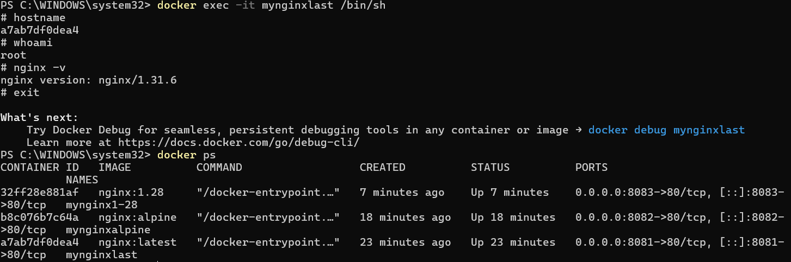

Во втором опыте я пересоздал mynginxlast с /bin/sh в качестве основного процесса. После exit этот контейнер завершился. Затем я восстановил обычный фоновый запуск Nginx.

```powershell
docker stop mynginxlast
docker rm mynginxlast
docker run -it --name mynginxlast -p 8081:80 nginx:latest /bin/sh
```

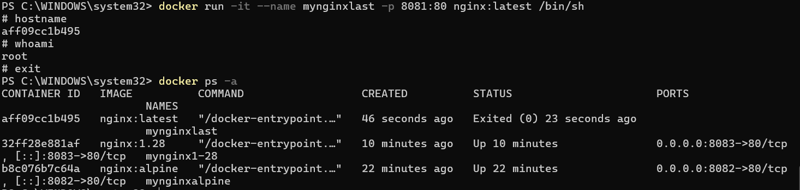


## Задание 1 Собственная страница и монтирование

В каталоге task1 я создал index.html с тегами html, head, title, body, h1 и p. На странице указал название лабораторной, название задания, своё имя и группу 13. Каталог подключил в /usr/share/nginx/html контейнера mynginxalpine в режиме только для чтения.

```powershell
docker stop mynginxalpine
docker rm mynginxalpine
$sitePath = (Resolve-Path .\task1).Path
docker run -d --name mynginxalpine -p 8082:80 `
  --mount "type=bind,source=$sitePath,target=/usr/share/nginx/html,readonly" `
  nginx:alpine
```

Команды этого фрагмента выполняются из корня проекта. В PowerShell обратная кавычка в конце строки обозначает перенос команды. В браузере по адресу http://localhost:8082 я получил собственную страницу вместо стандартной страницы Nginx.

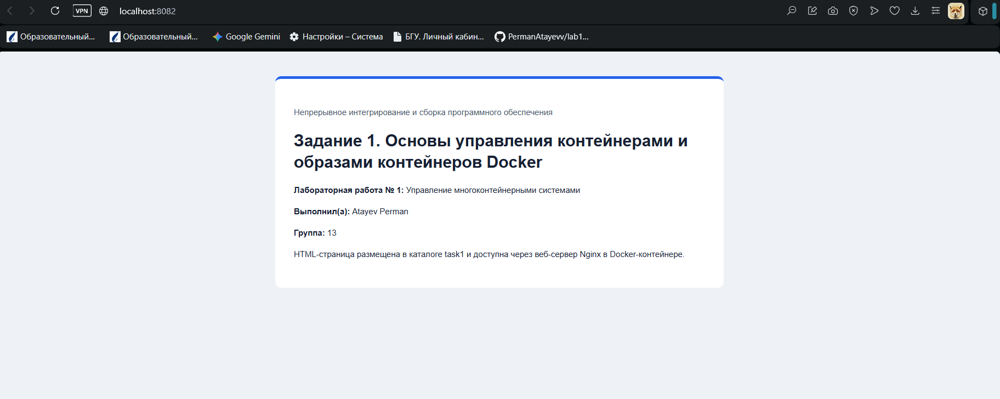

Вывод по заданию 1: я освоил запуск, остановку, повторный запуск и удаление контейнеров, просмотр образов, вход в оболочку и подключение каталога хоста. При bind mount содержимое сайта берётся из файлов на компьютере.


## Задание 2 Создание собственного образа сайта

Я создал каталог task2, скопировал туда index.html и написал Dockerfile. В отличие от предыдущего опыта, HTML-файл теперь включается в образ во время сборки, поэтому подключение каталога хоста при запуске не требуется.

```dockerfile
FROM nginx:alpine
COPY index.html /usr/share/nginx/html/index.html
```

```powershell
docker build -t lab1-site:v1 .
docker run -d --name lab1-site-check -p 8084:80 lab1-site:v1
docker image ls lab1-site
curl.exe -I http://localhost:8084
```

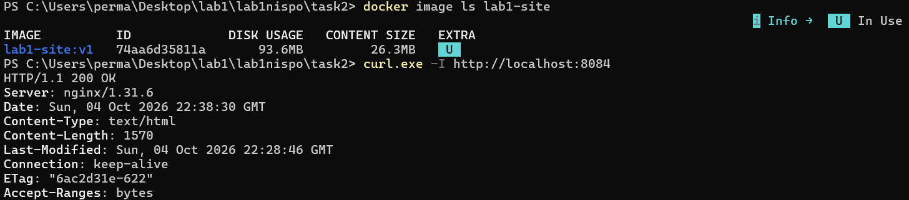

На скриншоте размер lab1-site:v1 составляет 93,6 MB по колонке DISK USAGE и 26,3 MB по колонке CONTENT SIZE. В браузере отображается та же HTML-страница с моими данными.

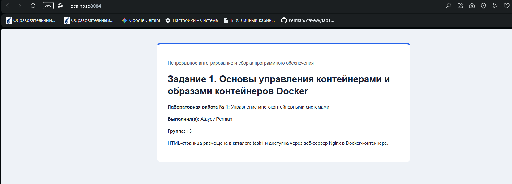


## Задание 2 Публикация и проверка Docker Hub

Я вошёл в Docker Hub под именем permanata, присвоил локальному образу тег permanata/lab1-site:v1 и опубликовал его командой docker push. В выводе появилась строка digest, а во вкладке Tags репозитория — тег v1.

```powershell
docker login
docker tag lab1-site:v1 permanata/lab1-site:v1
docker push permanata/lab1-site:v1
```

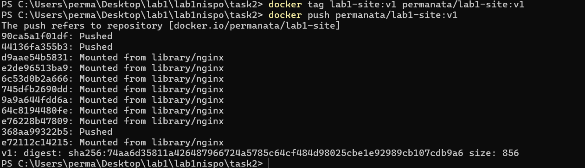

Репозиторий образа: https://hub.docker.com/r/permanata/lab1-site. После публикации я выполнил pull и запустил отдельный проверочный контейнер на порту 8085. Сообщение Image is up to date показало, что локальная копия соответствует опубликованной.

```powershell
docker pull permanata/lab1-site:v1
docker run -d --name lab1-hub-check -p 8085:80 permanata/lab1-site:v1
curl.exe -I http://localhost:8085
```

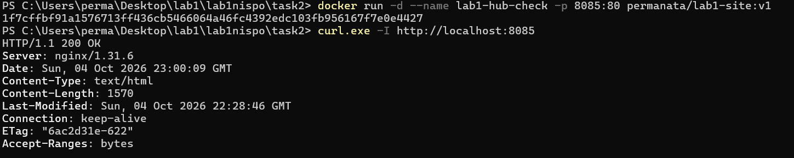

Вывод по заданию 2: я собрал переносимый образ сайта, опубликовал его в реестре и проверил запуск по полному имени образа.


## Задание 3 PostgreSQL и локальное окружение Python

Для приложения я создал task3/simple_python_app, пользовательскую сеть lab1-task3-net и именованный том lab1-task3-pgdata. PostgreSQL запустил с базой api, пользователем apiuser и учебным паролем apipass. Порт БД опубликован только на 127.0.0.1.

```powershell
docker network create lab1-task3-net
docker volume create lab1-task3-pgdata
docker run -d --name postgres-db --network lab1-task3-net `
  -e POSTGRES_USER=apiuser -e POSTGRES_PASSWORD=apipass -e POSTGRES_DB=api `
  -p 127.0.0.1:5432:5432 `
  --mount type=volume,source=lab1-task3-pgdata,target=/var/lib/postgresql/data `
  postgres:16.2-alpine
docker exec postgres-db pg_isready -U apiuser -d api
docker exec postgres-db psql -U apiuser -d api -c "SELECT version();"
```

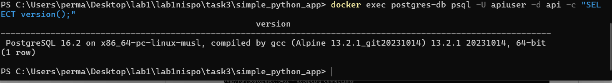

Далее я создал виртуальное окружение на установленном Python 3.14.7, установил зависимости и проверил их совместимость. Для локального окружения использовал готовый пакет psycopg2-binary.

```powershell
py -3.14 -m venv .venv
.\.venv\Scripts\python.exe -m pip install -r requirements.dev.txt
.\.venv\Scripts\python.exe -m pip check
```

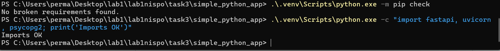


## Задание 3 Разработка и локальная проверка API

Я написал приложение FastAPI с двумя маршрутами из методички. Корневой маршрут выполняет SELECT version() и возвращает версию PostgreSQL, а /hello/{name} формирует приветствие. Параметры соединения читаются из переменных API_DB_HOST, API_DB_PORT, API_DB_NAME, API_DB_USER и API_DB_PASS.

```powershell
.\.venv\Scripts\python.exe -m uvicorn app:app --host 127.0.0.1 --port 8000
```

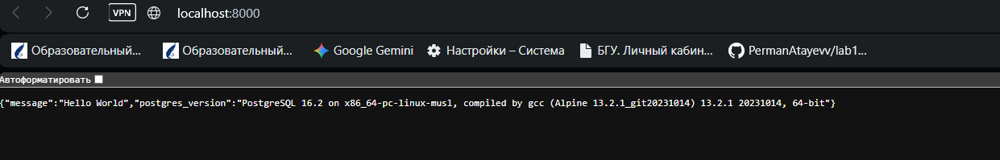

Чтобы реализовать хранение данных, я добавил таблицу notes с полями id и text. При запуске выполняется CREATE TABLE IF NOT EXISTS. Маршрут POST /notes записывает заметку, GET /notes возвращает список. Вставка выполняется параметризованным SQL-запросом с подтверждением транзакции.

| Запрос | Назначение |
| --- | --- |
| GET / | Приветствие и версия PostgreSQL |
| GET /hello/{name} | Персональное приветствие |
| POST /notes | Добавление заметки |
| GET /notes | Чтение заметок |
| GET /docs | Интерактивная документация Swagger UI |

Через Swagger UI я добавил заметки и проверил чтение. На скриншоте показаны две записи с идентификаторами 1 и 2.

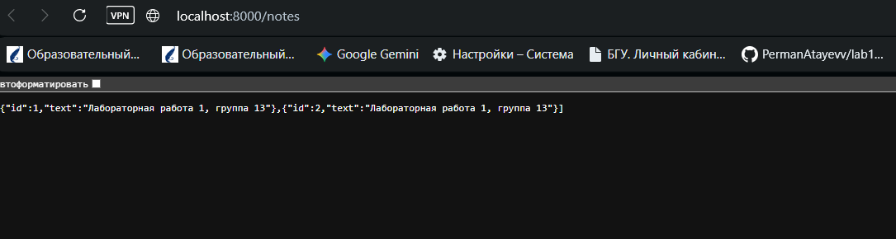


## Задание 3 Базовый образ v1

Для контейнерного запуска я создал requirements.txt с psycopg2 и .dockerignore, исключающий виртуальное окружение Windows, кеш Python и каталог Git. В исходной сборке v1 код копируется до установки пакетов.

```dockerfile
FROM python:3.14
COPY . /app/
RUN apt-get update \
    && apt-get install -y gcc libpq-dev
RUN pip install -r /app/requirements.txt
WORKDIR /app
CMD ["uvicorn", "app:app", "--host", "0.0.0.0", "--port", "8000"]
```

```powershell
docker build -t simple_python_app:v1 .
docker run -d --name lab1-app-v1 --network lab1-task3-net `
  -e API_DB_HOST=postgres-db -e API_DB_PORT=5432 -e API_DB_NAME=api `
  -e API_DB_USER=apiuser -e API_DB_PASS=apipass `
  -p 127.0.0.1:8001:8000 simple_python_app:v1
```

Внутри Docker-сети я указал адрес БД postgres-db. Адрес 127.0.0.1 внутри контейнера приложения обозначал бы сам контейнер приложения. Uvicorn слушает 0.0.0.0, чтобы принимать запросы через опубликованный порт.

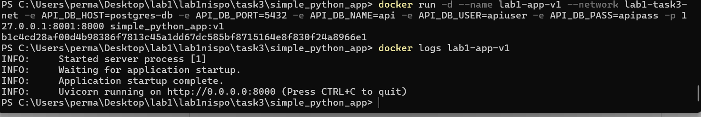

Проверка / и /notes на порту 8001 подтвердила связь с PostgreSQL и доступ к ранее созданным данным. Размер v1 составил 1,76 GB по DISK USAGE.


## Задание 3 Кеширование и состав файлов v2 и v3

В v2 я перенёс установку системных пакетов и Python-зависимостей выше копирования исходного кода. После добавления комментария в app.py повторил сборку. Шаги установки пакетов получили отметку CACHED, а COPY выполнился заново.

```powershell
docker build --progress=plain -t simple_python_app:v2 -f Dockerfile.v2 .
Add-Content -Path app.py -Value "`n# Cache test for v2" -Encoding UTF8
docker build --progress=plain -t simple_python_app:v2 -f Dockerfile.v2 .
```

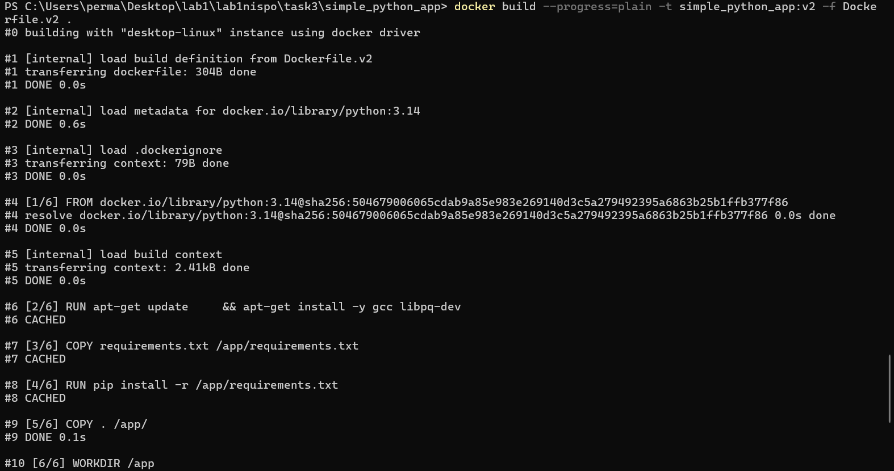

В v3 я заменил COPY . /app/ на COPY app.py /app/app.py. requirements.txt подключил только на время RUN через BuildKit bind mount. Просмотр /app подтвердил, что в него включён только app.py.

```powershell
docker run --rm simple_python_app:v3 ls -la /app
```

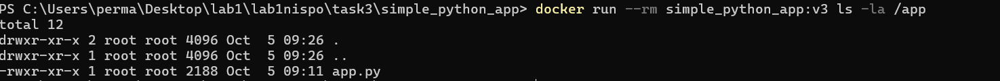

Размеры v1, v2 и v3 в округлённом выводе совпали. При этом v2 улучшает повторное использование кеша, а v3 исключает лишние файлы из приложения. Точное время ускорения я не измерял.


## Задание 3 Очистка кешей и сборка Slim

В v4 я добавил --no-install-recommends для apt, удаление /var/lib/apt/lists/* в той же инструкции RUN и --no-cache-dir для pip. При этом зависимости пакетов устанавливаются полностью: --no-deps не используется. Размер снизился с 1,76 до 1,69 GB.

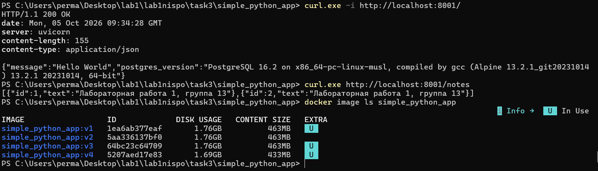

В v5 я перешёл к многоэтапной сборке. Этап builder на python:3.14-slim собирает wheel-пакеты, а финальный этап устанавливает их и libpq5. Компилятор и заголовочные файлы не переходят в финальный образ. Wheel-файлы подключаются временно через RUN --mount=type=bind,from=builder.

При первой сборке возникла ошибка fatal error: assert.h: No such file or directory. Я добавил libc6-dev к gcc и libpq-dev в builder. После этого образ собрался, а pip check не обнаружил конфликтов. В приложении к отчёту приведена исправленная конфигурация.

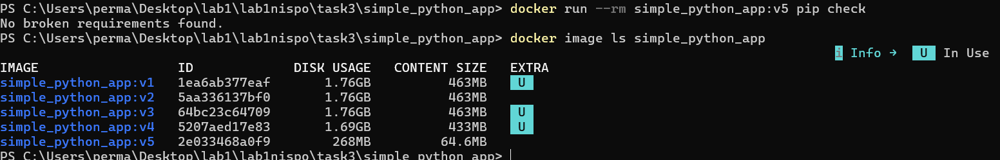

Работу Slim я подтвердил запросами к / и /notes. Существующие записи сохранились, поскольку новая версия приложения использует ту же базу данных.


## Задание 3 Alpine и непривилегированный пользователь

Я подготовил Dockerfile.alpine с двумя этапами на python:3.14-alpine. Для сборки установил build-base, postgresql-dev и linux-headers, для выполнения — libpq и libstdc++. Сборка Alpine прошла проверку зависимостей и HTTP-запросов; её размер составил 157 MB.

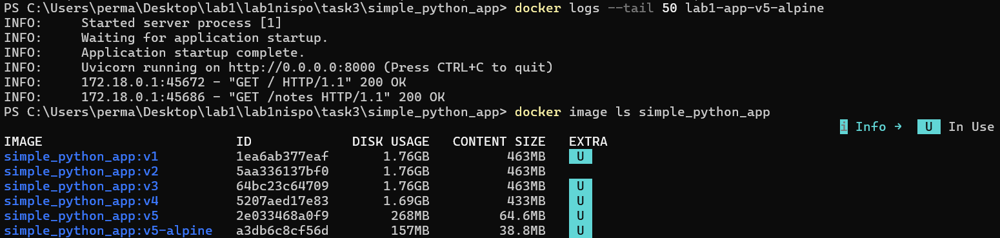

Для финальной версии v6 я вернулся к Slim, создал системную группу и пользователя app, назначил владельца app.py через COPY --chown и добавил USER app. Сравнение командой id показало переход от root к UID и GID 999.

```powershell
docker run --rm simple_python_app:v5 id
docker run --rm simple_python_app:v6 id
```

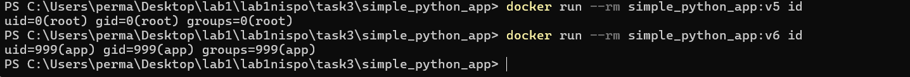

В v6 команда pip check завершилась без конфликтов. Предупреждение о недоступном каталоге кеша pip не помешало проверке. Запросы к API подтвердили работу приложения и чтение заметок. Итоговый Dockerfile.v6 я скопировал в основной Dockerfile.


## Задание 3 Сравнение образов и устранение ошибок

| Версия | Изменение | DISK USAGE | CONTENT SIZE |
| --- | --- | --- | --- |
| v1 | Базовая сборка | 1,76 GB | 463 MB |
| v2 | Порядок инструкций | 1,76 GB | 463 MB |
| v3 | Только нужные файлы | 1,76 GB | 463 MB |
| v4 | Очистка кешей | 1,69 GB | 433 MB |
| v5 | Multi-stage Slim | 268 MB | 64,6 MB |
| v5-alpine | Multi-stage Alpine | 157 MB | 38,8 MB |
| v6 | Slim и USER app | 268 MB | 64,6 MB |

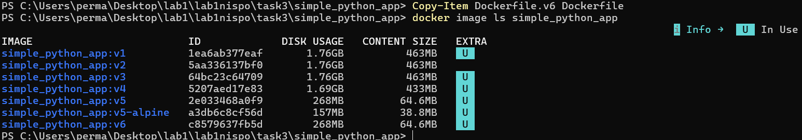

По округлённой колонке DISK USAGE переход от v1 к v5 уменьшил размер приблизительно на 84,8%, а от v5 к Alpine — на 41,4%. Добавление пользователя в v6 не изменило отображаемый округлённый размер. Значения разных колонок не смешиваются; их сумма не равна уникальному месту всех образов из-за общих слоёв.

При запуске v2 после остановки Docker база postgres-db оказалась остановлена. Приложение завершилось с ошибкой разрешения имени postgres-db. Я запустил базу, дождался accepting connections и повторно запустил приложение. Проверка сети показала оба контейнера в lab1-task3-net, после чего API вернул HTTP 200 OK и сохранённые записи.

Также я учёл, что docker start запускает существующий контейнер с прежним образом. После пересборки тега для применения нового образа контейнер приложения нужно пересоздать.

Вывод по заданию 3: я реализовал приложение с хранением данных, проверил его локально и в контейнере, исследовал кеш сборки, сравнил семь вариантов образа и настроил запуск без root.


## Задание 4 Структура многоконтейнерного проекта

В каталоге task4/compose я подготовил compose.yaml, конфигурацию nginx/app.conf и каталог simple_python_app с кодом, зависимостями и Dockerfile версии v6. Для этого задания создал отдельную базу данных и том.

| Сервис | Роль | Подключение |
| --- | --- | --- |
| web | Nginx, обратный прокси | frontend-net; порт хоста 8080 |
| simple_python_app | FastAPI и Uvicorn | frontend-net и backend-net |
| db | PostgreSQL | backend-net; том dbdata |

Клиент обращается к Nginx по адресу http://localhost:8080. Nginx пересылает запрос на http://simple_python_app:8000, а приложение подключается к db:5432. Порты приложения и PostgreSQL не опубликованы на хост. Две сети разделяют прямую связность: Nginx и БД не подключены к одной сети.

Готовность db проверяется pg_isready. Приложение запускается после успешной проверки БД, а Nginx — после успешного HTTP healthcheck приложения. Корневой маршрут приложения обращается к PostgreSQL, поэтому его проверка также подтверждает связь с базой.

```powershell
docker compose config -q
docker compose up -d --build
docker compose ps
```

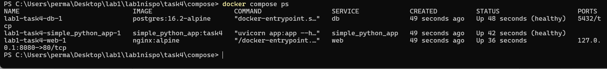

Полные compose.yaml и app.conf приведены в приложении. В конфигурации использованы учебные реквизиты БД; она предназначена для локальной лабораторной работы.


## Задание 4 Проверка запросов через Nginx

После запуска инфраструктуры я проверил корневой маршрут, приветствие и список заметок через порт 8080. Ответ содержал Server: nginx и JSON от FastAPI, что подтвердило прохождение запроса через обратный прокси к приложению.

```powershell
curl.exe -i http://localhost:8080/
curl.exe http://localhost:8080/hello/Student
curl.exe http://localhost:8080/notes
```

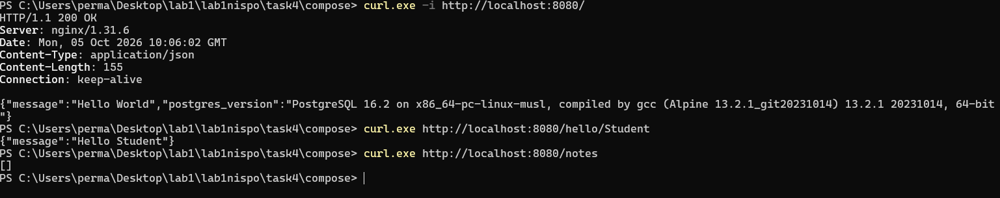

При первом обращении /notes вернул пустой массив, поскольку база задания 4 новая. Затем через Swagger UI я добавил запись «Задание 4: Nginx, FastAPI и PostgreSQL через Docker Compose» и прочитал её через GET /notes. Записи присвоен id=1.

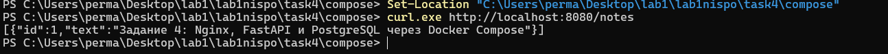

Проверки выполнены вручную через браузер, Swagger UI и curl.exe. Автоматический набор тестов в данном черновике не зафиксирован; в отчёте приведены наблюдаемые результаты функциональных проверок.


## Задание 4 Сохранение данных после пересоздания

Для проверки тома я прочитал заметку, остановил проект с удалением контейнеров командой docker compose down и создал контейнеры заново командой docker compose up -d --wait. Опцию -v при этом не использовал.

```powershell
curl.exe http://localhost:8080/notes
docker compose down
docker compose up -d --wait
docker compose ps
curl.exe http://localhost:8080/notes
```

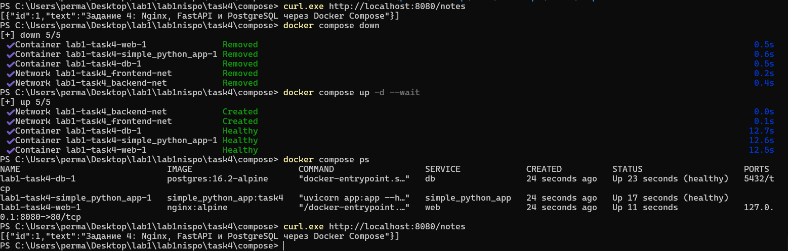

После повторного запуска сервисы перешли в рабочее состояние, а /notes вернул запись с тем же id=1 и тем же текстом. Следовательно, данные хранятся в именованном томе dbdata независимо от жизненного цикла контейнера PostgreSQL.

Вывод по заданию 4: я описал три сервиса, две сети, том и проверки готовности в одном compose.yaml. Запуск инфраструктуры автоматизирован, а сохранность данных подтверждена пересозданием контейнеров.

Команда docker compose down -v из примера методички удаляет также том. В представленных результатах её выполнение не зафиксировано: для опыта по сохранности данных выполнена остановка без -v.


## Сводные результаты проверок

| Проверка | Наблюдаемый результат |
| --- | --- |
| Nginx на 8081, 8082 и 8083 | HTTP 200 OK; страницы открываются |
| Собственный образ на 8084 | HTTP 200 OK; HTML включён в образ |
| Образ Docker Hub на 8085 | HTTP 200 OK после pull и запуска |
| Локальное API на 8000 | Версия PostgreSQL и список заметок |
| Приложение в Docker на 8001 | Версия БД и ранее созданные записи |
| Кеш повторной сборки v2 | CACHED для установки зависимостей |
| pip check для оптимизированных образов | No broken requirements found |
| Пользователь v5 / v6 | root / app с uid=999 и gid=999 |
| Compose на 8080 | Nginx передаёт запросы в FastAPI |
| Повторное создание Compose-контейнеров | Заметка id=1 и её текст сохранились |


### Общий вывод

В ходе лабораторной работы я научился управлять контейнерами и образами, подключать каталоги и тома, публиковать собственный образ в Docker Hub и объединять приложение с PostgreSQL. На практике я проверил влияние порядка инструкций и многоэтапной сборки, уменьшил образ и настроил запуск от непривилегированного пользователя. Docker Compose позволил описать инфраструктуру декларативно и учитывать готовность зависимых сервисов.

В отчёте использованы мои скриншоты и команды из черновика, а также исправления, выполненные в ходе работы. Публикация исходного кода и отчёта в GitHub в предоставленных результатах пока не подтверждена: её необходимо выполнить отдельно.


## Приложение А Код приложения

Итоговый app.py. Отступы восстановлены для корректного копирования из отчёта; диагностический комментарий опыта с кешем на логику приложения не влияет.

```python
import os
from contextlib import asynccontextmanager, closing

import psycopg2
from fastapi import FastAPI
from pydantic import BaseModel, Field


def connect_db():
    return psycopg2.connect(
        host=os.getenv("API_DB_HOST", "127.0.0.1"),
        port=os.getenv("API_DB_PORT", "5432"),
        dbname=os.getenv("API_DB_NAME", "api"),
        user=os.getenv("API_DB_USER", "apiuser"),
        password=os.getenv("API_DB_PASS", "apipass"),
        connect_timeout=5,
    )


@asynccontextmanager
async def lifespan(app: FastAPI):
    with closing(connect_db()) as connection:
        with connection:
            with connection.cursor() as cursor:
                cursor.execute("""
                    CREATE TABLE IF NOT EXISTS notes (
                        id SERIAL PRIMARY KEY,
                        text TEXT NOT NULL
                    );
                """)
    yield


app = FastAPI(title="Lab 1 — Group 13", lifespan=lifespan)


class NoteCreate(BaseModel):
    text: str = Field(min_length=1, max_length=1000)
```


## Приложение А Маршруты приложения

```python
@app.get("/")
def root():
    with closing(connect_db()) as connection:
        with connection.cursor() as cursor:
            cursor.execute("SELECT version();")
            version = cursor.fetchone()[0]
    return {"message": "Hello World", "postgres_version": version}


@app.get("/hello/{name}")
def say_hello(name: str):
    return {"message": f"Hello {name}"}


@app.post("/notes", status_code=201)
def create_note(note: NoteCreate):
    with closing(connect_db()) as connection:
        with connection:
            with connection.cursor() as cursor:
                cursor.execute(
                    "INSERT INTO notes (text) VALUES (%s) RETURNING id, text;",
                    (note.text,),
                )
                row = cursor.fetchone()
    return {"id": row[0], "text": row[1]}


@app.get("/notes")
def list_notes():
    with closing(connect_db()) as connection:
        with connection.cursor() as cursor:
            cursor.execute("SELECT id, text FROM notes ORDER BY id;")
            rows = cursor.fetchall()
    return [{"id": row[0], "text": row[1]} for row in rows]
```


## Приложение Б Зависимости и итоговый Dockerfile


### requirements dev txt для локального запуска

```text
fastapi==0.142.2
uvicorn[standard]==0.53.0
psycopg2-binary==2.9.13
```


### requirements txt для сборки контейнера

```text
fastapi==0.142.2
uvicorn[standard]==0.53.0
psycopg2==2.9.13
```


### Dockerfile версии v6

```dockerfile
# syntax=docker/dockerfile:1
FROM python:3.14-slim AS builder
RUN apt-get update \
    && apt-get install -y --no-install-recommends gcc libc6-dev libpq-dev \
    && rm -rf /var/lib/apt/lists/*
RUN --mount=type=bind,source=requirements.txt,target=/tmp/requirements.txt \
    pip wheel --no-cache-dir -r /tmp/requirements.txt --wheel-dir /wheels

FROM python:3.14-slim
RUN apt-get update \
    && apt-get install -y --no-install-recommends libpq5 \
    && rm -rf /var/lib/apt/lists/*
RUN --mount=type=bind,from=builder,source=/wheels,target=/wheels \
    pip install --no-cache-dir --no-index /wheels/*
RUN groupadd --system app \
    && useradd --system --gid app --no-create-home app
WORKDIR /app
COPY --chown=app:app app.py /app/app.py
USER app
CMD ["uvicorn", "app:app", "--host", "0.0.0.0", "--port", "8000"]
```


### Файл dockerignore

```text
.venv/
venv/
__pycache__/
*.pyc
.git/
```


## Приложение В Конфигурация Docker Compose

```yaml
name: lab1-task4
services:
  web:
    image: nginx:alpine
    ports:
      - "127.0.0.1:8080:80"
    volumes:
      - ./nginx/app.conf:/etc/nginx/conf.d/default.conf:ro
    networks:
      - frontend-net
    depends_on:
      simple_python_app:
        condition: service_healthy

  simple_python_app:
    image: simple_python_app:task4
    build: ./simple_python_app
    environment:
      API_DB_HOST: db
      API_DB_PORT: "5432"
      API_DB_NAME: api
      API_DB_USER: apiuser
      API_DB_PASS: apipass
    networks:
      - frontend-net
      - backend-net
    depends_on:
      db:
        condition: service_healthy
    healthcheck:
      test:
        - CMD
        - python
        - -c
        - >-
          import urllib.request;
          urllib.request.urlopen('http://127.0.0.1:8000/', timeout=3).read()
      interval: 10s
      timeout: 5s
      retries: 5
      start_period: 20s
```

Продолжение того же compose.yaml приведено на следующей странице. Список test записан многострочно для удобства чтения; команда совпадает с проверкой в выполненном проекте.


## Приложение В База данных и конфигурация Nginx

```yaml
db:
    image: postgres:16.2-alpine
    environment:
      POSTGRES_DB: api
      POSTGRES_USER: apiuser
      POSTGRES_PASSWORD: apipass
    volumes:
      - dbdata:/var/lib/postgresql/data
    networks:
      - backend-net
    healthcheck:
      test: ["CMD-SHELL", "pg_isready -U apiuser -d api"]
      interval: 5s
      timeout: 5s
      retries: 10
      start_period: 10s

networks:
  frontend-net:
  backend-net:
volumes:
  dbdata:
```


### nginx app conf

```nginx
server {
    listen 80;
    server_name localhost;
    location / {
        proxy_pass http://simple_python_app:8000;
        proxy_set_header Host $host;
        proxy_set_header X-Real-IP $remote_addr;
        proxy_set_header X-Forwarded-For $proxy_add_x_forwarded_for;
        proxy_set_header X-Forwarded-Proto $scheme;
    }
}
```

Для запуска из каталога task4/compose: docker compose up -d --build. Для остановки с сохранением тома: docker compose down. Для удаления также учебных данных: docker compose down -v. Последняя команда приведена как инструкция, а не как подтверждённый результат выполнения.


## Контрольные вопросы 1–4


### 1 Что такое Docker и какие есть альтернативы

Docker — платформа сборки, распространения и запуска контейнеров. Она упрощает воспроизводимость окружения и изоляцию процессов. Linux-контейнеры используют ядро Linux; на моём Windows оно доступно через WSL2. Podman подходит для daemonless и rootless-сценариев, containerd — для управления жизненным циклом контейнеров, в том числе в Kubernetes.


### 2 Что такое образ и чем он отличается от контейнера

Образ содержит файловые слои и конфигурацию запуска. Контейнер — экземпляр образа с собственным изменяемым слоем и состоянием процесса. Образ получают через docker pull, собирают docker build либо создают docker commit из контейнера. Для воспроизводимости предпочтительнее Dockerfile.


### 3 Как запустить контейнер и ограничить ресурсы

Пример: docker run -d --name web -p 8080:80 --cpus=1 --memory=256m nginx:alpine. Опция -p публикует порт, --name задаёт имя, --cpus и --memory ограничивают CPU и память. EXPOSE в Dockerfile сам по себе порт не публикует.


### 4 Как просматривать и фильтровать логи

docker logs --since 10m --tail 100 имя показывает последние записи; -f включает наблюдение. В PowerShell текст фильтруют через Select-String, например docker logs имя 2>&1 | Select-String ERROR. Фильтр уровня зависит от формата логов приложения. Для json-file задают max-size и max-file; изменения настроек демона применяют к вновь созданным контейнерам.


## Контрольные вопросы 5–8


### 5 Как сохранять данные и выбирать тип хранения

Volume управляется Docker и подходит для данных БД; bind mount подключает конкретный путь хоста, например код или конфигурацию; tmpfs хранит временные данные в памяти без сохранения после остановки. В работе использованы bind mount для HTML и конфигурации Nginx, а volume — для PostgreSQL.


### 6 Как объединить контейнеры сетью

Создать сеть docker network create lab-net и указать --network lab-net при запуске. Пользовательская bridge-сеть подходит для одного хоста, host убирает сетевую изоляцию относительно хоста там, где режим поддерживается, overlay связывает узлы, например в Swarm. Альтернатива прямой связи контейнеров — опубликованные порты или внешний сервис.


### 7 Почему доступны имена контейнеров и сервисов

На пользовательской Docker-сети встроенный DNS разрешает имена контейнеров и сетевые псевдонимы. Compose предоставляет имена сервисов. IP при пересоздании может измениться, поэтому приложение должно использовать имя и переподключаться. После переименования сервиса нужно обновить ссылки на старое имя.


### 8 Что такое теги образов

Тег — изменяемая ссылка на образ: docker tag lab1-site:v1 permanata/lab1-site:v1. latest — обычный тег, а не гарантия самой новой версии. Версионные теги удобнее для релизов, digest обеспечивает точную идентификацию. docker image rm имя:тег снимает тег; удаление данных образа зависит от оставшихся ссылок и использования.


## Контрольные вопросы 9–12


### 9 Как удалять ненужные ресурсы

docker rm удаляет остановленный контейнер, docker image rm — образ или тег. Команды container prune и image prune очищают подходящие неиспользуемые ресурсы; фильтры помогают ограничить выбор. Автоматизацию выполняют скриптом по расписанию с проверкой списка. Тома очищают отдельно и только когда данные больше не нужны.


### 10 Чем различаются exec attach и команда запуска

docker exec выполняет новый процесс в работающем контейнере. docker attach подключает терминал к потокам основного процесса. Для штатного запуска приложения используют CMD и ENTRYPOINT; exec удобен для диагностики. В моём опыте выход из exec-оболочки не останавливал Nginx.


### 11 Как увидеть изменения файлов

docker diff имя показывает добавленные, изменённые и удалённые пути изменяемого слоя контейнера. docker image history показывает историю слоёв, inspect — метаданные. Для подробного сравнения образов можно экспортировать содержимое или использовать анализатор слоёв. Изменения внутри подключённых томов нужно исследовать отдельно.


### 12 Когда контейнер завершается и как остановить корректно

Контейнер завершается при завершении основного процесса. docker stop отправляет сигнал остановки, обычно SIGTERM, затем при превышении тайм-аута SIGKILL. Приложение должно обработать сигнал, закончить запросы и закрыть ресурсы. В Compose время ожидания задают stop_grace_period; exec-форма CMD облегчает доставку сигнала приложению.


## Контрольные вопросы 13–16


### 13 Как работает кеш слоёв

При неизменных инструкциях и входных данных сборщик может повторно использовать результат шага. Раннее копирование часто меняющегося кода инвалидирует последующие шаги. Поэтому зависимости копируют и устанавливают до кода, а .dockerignore сокращает контекст. В v2 после изменения app.py установка пакетов осталась CACHED. Время можно измерить Measure-Command; multi-stage прежде всего уменьшает финальный состав образа.


### 14 Сколько слоёв нужно и как оптимизировать размер

Универсального минимального числа слоёв нет: важны воспроизводимость, кеширование и итоговый состав. Связанные операции установки и очистки объединяют в RUN, чтобы временные файлы не остались в предыдущем слое. Код отделяют от зависимостей для кеша. Размер смотрят через image ls, историю — через image history. Удаление файла в новом слое не убирает его из старого.


### 15 Основные инструкции Dockerfile и проверка ошибок

FROM выбирает базу, RUN выполняет шаг сборки, COPY копирует файлы, ADD имеет дополнительные способы получения данных, WORKDIR задаёт каталог, ENV — окружение, EXPOSE — метаданные порта, CMD — команду или аргументы по умолчанию, ENTRYPOINT — основную команду запуска. Ошибки: секреты в слоях, лишние файлы, запуск демона при сборке. Синтаксис сверяют с Dockerfile reference; hadolint помогает находить типичные проблемы.


### 16 Что такое контекст сборки

Контекст — набор файлов, доступных сборщику для COPY, ADD и монтирования при сборке. В docker build . контекстом является текущий каталог. Не следует рассчитывать на копирование произвольных файлов вне контекста. .dockerignore исключает ненужные каталоги, уменьшает передачу данных и вероятность попадания лишних файлов в образ.


## Контрольные вопросы 17–20


### 17 Чем отличаются COPY и ADD

COPY используется для обычного копирования из контекста или другого этапа. ADD также умеет получать удалённые источники и распаковывать поддерживаемые локальные архивы. Для понятного обычного копирования выбирают COPY; ADD применяют, когда действительно нужна его дополнительная семантика.


### 18 Чем отличаются CMD и ENTRYPOINT

ENTRYPOINT задаёт основной исполняемый процесс, CMD — команду по умолчанию либо аргументы к ENTRYPOINT. Аргументы docker run обычно заменяют CMD, --entrypoint заменяет ENTRYPOINT. Exec-форма задаётся JSON-массивом и не запускает оболочку автоматически. При отсутствии ENTRYPOINT команда CMD ["python", "app.py"] запускает Python напрямую.


### 19 Чем отличаются ARG и ENV

ARG задаёт параметр этапа сборки и не становится автоматически переменной запущенного контейнера. ENV сохраняется в конфигурации образа и доступна во время выполнения, если её не переопределить. ARG имеет область видимости по этапам. Оба механизма не предназначены для безопасной передачи секретов сборки; для этого используют BuildKit secret mounts.


### 20 Что такое многоэтапная сборка

Несколько FROM создают независимые этапы. Сборочные инструменты устанавливают в builder, а в финальный образ передают только результаты. Например, Go-компилятор создаёт бинарник, который копируется в минимальный runtime. В моей работе builder собрал wheel-пакеты Python, установленные затем в Slim без компилятора.


## Контрольные вопросы 21–24


### 21 Из чего состоит Docker Engine

Docker Engine включает демон dockerd, API и CLI для управления объектами. Для выполнения контейнеров используются containerd и низкоуровневый runtime, например runc. CLI обращается к API демона. Docker Desktop дополнительно организует окружение запуска на Windows и macOS.


### 22 Как получить подробные сведения о контейнере

docker inspect имя выводит JSON с конфигурацией, состоянием, сетями и монтированиями. IP находятся в NetworkSettings.Networks, тома — в Mounts, переменные — в Config.Env. Например, docker inspect postgres-db позволяет проверить сеть и том БД. Вывод окружения может содержать пароли, поэтому его не публикуют без проверки.


### 23 Как посмотреть потребление ресурсов

docker stats показывает текущие CPU, память, сеть и дисковый ввод-вывод контейнеров. docker stats --no-stream выполняет одно измерение. Для оценки нужно учитывать ограничения контейнера и ресурсы среды Docker Desktop.


### 24 Что умеет Docker Compose и чем отличаются поколения

Compose описывает сервисы, сети, тома, секреты, профили, сборку и зависимости в YAML. Исторический docker-compose v1 — отдельная Python-утилита; современная команда docker compose интегрируется с Docker CLI. Поддержка --wait, watch и новых полей определяется версией современного Compose; устаревший v1 их не предоставляет. В работе установлен плагин v5.5.1.


## Контрольные вопросы 25–28


### 25 Как задать порядок запуска с учётом готовности

Короткий depends_on задаёт порядок запуска, но не гарантирует готовность приложения. Для ожидания используют healthcheck зависимости и condition: service_healthy. В моей конфигурации приложение ждёт БД, а Nginx — приложение. Это не заменяет обработку потери соединения после успешного запуска.


### 26 Что такое Healthcheck

Healthcheck периодически выполняет команду проверки и формирует состояние starting, healthy или unhealthy. interval задаёт частоту, timeout — лимит времени, retries — число неудач, start_period — начальный период. pg_isready проверяет готовность PostgreSQL; HTTP-запрос проверяет приложение. Статус unhealthy сам по себе обычно не перезапускает контейнер.


### 27 Как переопределять Compose для окружений

Можно передать несколько файлов: docker compose -f compose.yaml -f compose.prod.yaml up -d. Поздние файлы дополняют или переопределяют ранние по правилам Compose, а не простым объединением текста. Итог проверяют docker compose ... config. Значения подставляют через переменные и --env-file, профили выбирают дополнительные сервисы.


### 28 Зачем запускать приложение без root

Непривилегированный пользователь уменьшает доступные процессу права и последствия ошибки приложения. В Dockerfile создают пользователя, назначают необходимые права на файлы и задают USER app. При этом non-root не заменяет остальные меры изоляции. В v6 проверка показала uid=999(app).


## Контрольные вопросы 29–32


### 29 Как использовать файловую систему только для чтения

При запуске задают --read-only, в Compose — read_only: true. Для нужных записей отдельно подключают тома или tmpfs, например для /tmp. Перед включением режима проверяют, где приложение создаёт кеш, логи и временные файлы. Подключённый том может оставаться доступным на запись независимо от корневой файловой системы.


### 30 Как передавать секреты

Секреты не включают в Dockerfile, исходный код и слои образа. Для сборки применяют BuildKit secrets, для выполнения — файлы секретов Compose или внешнее хранилище. Доступ к файлам ограничивают; .env сам по себе не является защищённым хранилищем. В этой лабораторной использован учебный пароль; production-конфигурация требует другого способа передачи.


### 31 Какие ограничения Compose важны для production

Compose удобен для согласованного запуска на одном хосте, но сам не даёт полноценного многоузлового планирования и отказоустойчивости к потере хоста. Резервное копирование, мониторинг и обновления нужно организовать отдельно. Для распределённого кластера применяют Kubernetes или Swarm, учитывая сложность эксплуатации.


### 32 Что такое Swarm и чем он отличается от Kubernetes

Swarm — встроенный в Docker режим кластеризации с manager/worker-узлами, сервисами и репликами. Kubernetes — отдельная система оркестрации с собственной моделью API, контроллерами и развитой экосистемой. Swarm тесно связан с Docker, Kubernetes предоставляет более широкие механизмы расширения и управления сложными инфраструктурами.


## Источники и подготовка к сдаче

1. Методические указания «НИиСПО Лабработа1 2026–2027»: объём заданий для группы 13 — с. 11; задания 1–4 — с. 12–29; контрольные вопросы — с. 35–37.

2. Черновик «отчет Атаев.docx»: команды и скриншоты выполнения 4–5 октября 2026 года. Основные подтверждения включены в текст отчёта, все извлечённые снимки сохранены в комплекте Markdown.

3. Dockerfile reference — https://docs.docker.com/reference/dockerfile/

4. Control startup and shutdown order in Compose — https://docs.docker.com/compose/how-tos/startup-order/

5. Volumes — https://docs.docker.com/engine/storage/volumes/

6. Docker CLI reference — https://docs.docker.com/reference/cli/docker/

7. Docker Compose reference — https://docs.docker.com/reference/compose-file/

8. Репозиторий опубликованного образа — https://hub.docker.com/r/permanata/lab1-site


